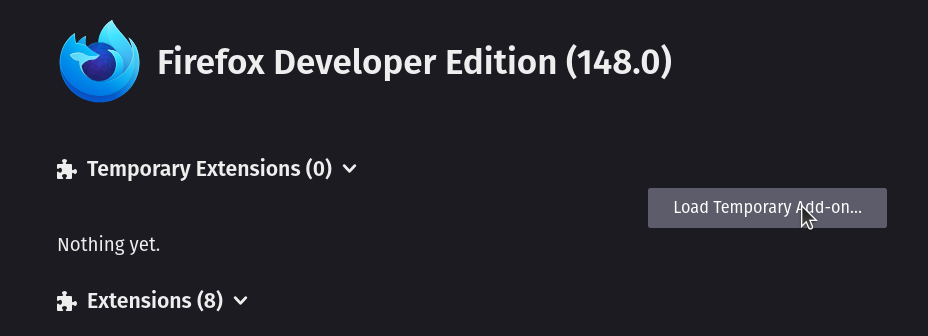
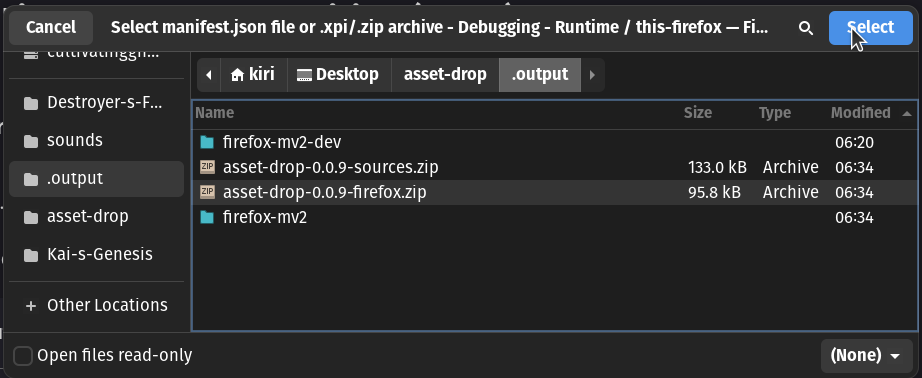
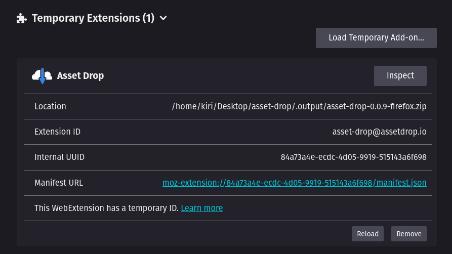

# Asset Drop

Download game assets directly into your project folder.

## Disclaimer

This program is for educational purposes only and only works for free assets

## How to Install

### Clone Repo

```bash
git clone https://github.com/urGirlkiri/asset-drop.git
```
### Change Dir

```bash
cd asset-drop
```

### Instal Deps

```bash
npm i
```

## Setup Native Bridge

The Native Bridge is required for the extension to save files to your disk and open folder dialogs.

## 🐧 Linux

### 1. Change Dir to Host

```bash
cd host
```

### 2. Install Bridge

```bash
chmod +x install.sh && ./install.sh
```

## 🪟 Windows

### 1. Change Dir to Host

```bash
cd host
```

### 2. Install Bridge

```bash
.\install_host.bat
```
_(Or simply double-click install_host.bat in File Explorer)_

## How to Install Extension

### Install From Addon Store

https://addons.mozilla.org/en-US/firefox/addon/asset-drop/


### Install From Source

#### Zip Extension


```bash
npm run zip
```

#### Open Firefox

[about:debugging#/runtime/this-firefox](about:debugging#/runtime/this-firefox
)

#### Load Temporary Extension




#### Select the Zip File



#### Done





## How to Debug


### 🐧 Linux

#### View Logs

```bash
tail -f /tmp/assetdrop_debug.log
```

#### Clear Logs 

```bash
rm /tmp/assetdrop_debug.log
```

### 🪟 Windows

#### View Logs

```bash
Get-Content $env:TEMP\assetdrop_debug.log -Wait
```
