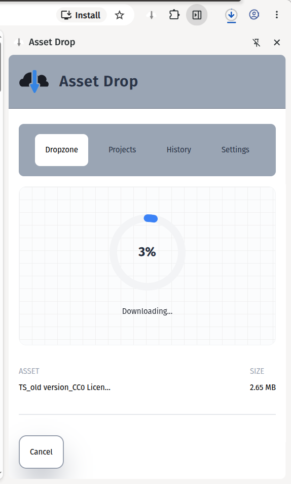

# Asset Drop

Download game assets directly into your project folder.

[![Chrome Web Store [BETA]](https://img.shields.io/badge/Chrome_Web_Store-329c4c?style=for-the-badge&logo=googlechrome&logoColor=white)](https://chromewebstore.google.com/detail/piglkcgaonkhnkfiiehpjblfnilmihgm)

## Usage

Click the extension icon or open the side panel 
Drop an Itch.io asset URL into the dropzone 
Select a project destination 
The asset will be downloaded and saved to your chosen folder 

### Supported Sites

[Itch.io](https://itch.io)

### Features

Auto-download assets from Itch.io 
Project management with custom destinations 
Download history tracking 
Optional auto-unzip and file organization 

### Documentation

### ‼️ Disclaimer ‼️

This program is for educational purposes only and only works for free public assets!

