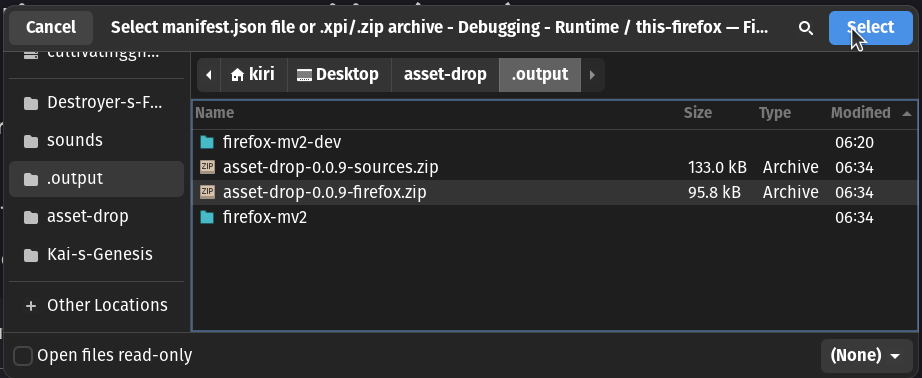
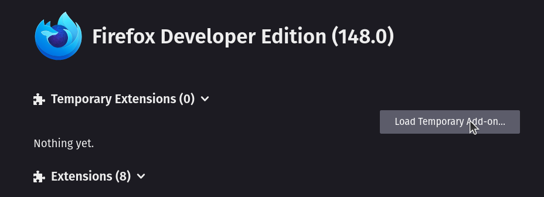
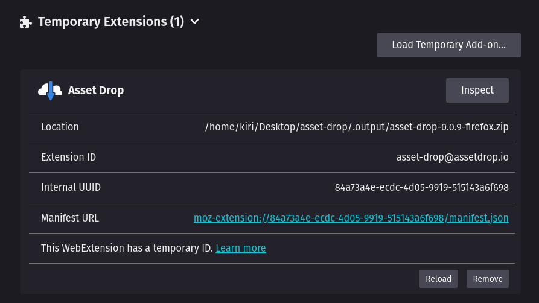

# Running

## Install From Source (Firefox)

```bash
npm run zip
```

Then open [about:debugging#/runtime/this-firefox](about:debugging#/runtime/this-firefox) in Firefox and load the temporary extension.

## Select Zip



## Load


## Done




## Install From Addon Store


<link href="https://addons.mozilla.org/en-US/firefox/addon/asset-drop/">
    
    
</link>
